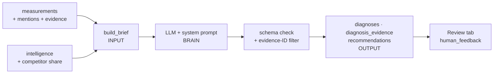

# Diagnosis framework: agent logic design

The diagnosis agent looks at one AI answer to one prompt and explains why the hotel did or didn't appear. It then proposes 1–4 actions. Nothing it writes is final: diagnoses are saved as `draft` and recommendations as `proposed`, and a person approves or rejects them on the Review tab.

Code: `agents/diagnosis/agent.py` · prompt: `agents/diagnosis/system_prompt.md` · output contract: `agents/diagnosis/schema.py`

## 1. Input: the brief

`build_brief(measurement_id)` builds one JSON object from Supabase. Each part answers a question the agent needs answered.

| Part | Contents | Source | Why the agent needs it |
|---|---|---|---|
| PROPERTY | Name, website, every alias, own domains | `properties` | To recognise the hotel under any name and tell its own pages apart |
| MEASUREMENT | Prompt, intent, engine, date, found?, rank, sentiment + reason, brands named, web search used | `measurements`, `prompts`, `intents`, `engines` | The outcome to explain |
| ANSWER | The engine's answer text (first 6,000 characters) | `measurements.response_text` | What the engine actually said and why |
| RANKED_BRANDS | Every brand ranked, with sentiment and descriptive keywords | `measurement_mentions` | Who won, and on what attributes |
| EVIDENCE | Up to 40 cited sources: `id`, domain, URL, who it was cited for, confidence | `evidence` | The only things the agent may point to as proof |
| CONTEXT | Same prompt on other engines; the intent's visibility on this engine and overall; top 5 competitors for the intent; own-domain citation count for the intent | `v_measurements_flat`, `v_competitor_share`, `evidence` | Separates a one-off from a pattern (sets severity and type) |
| CHECKS | Precomputed facts: `found_rankscale`, `found_any_alias`, `own_brand_names_in_answer`, `own_domain_cited_in_answer`, `found_on_other_engines`, intent visibility | Computed in Python | Facts the model shouldn't have to infer, and must not contradict |

## 2. Brain: the prompt

The full text is in `system_prompt.md`. The model works through a decision order and stops at the first type that explains the outcome:

| Order | Diagnosis type | Decision rule |
|---|---|---|
| 1 | *(none needed)* | Hotel at rank 1–2 with sentiment ≥ 0.6 → `diagnosis_needed: false` |
| 2 | `entity_confusion` | Outdated or wrong name (e.g. Crowne Plaza), mixed up with another property, or wrong facts |
| 3 | `negative_sentiment` | Present, but sentiment < 0.5 or negative keywords |
| 4 | `citation_gap` | Relevant, but no own or trusted third-party page cited while rivals' sources were |
| 5 | `content_gap` | Winning brands' cited pages name the occasion or feature; nothing cited shows the hotel saying it |
| 6 | `competitor_dominance` | The same few competitors win across engines and weeks |
| 7 | `other` | Nothing above fits; explained precisely |

Rules that keep it honest:
- **Evidence IDs are mandatory.** Every claim cites an evidence ID in brackets. After the model answers, any ID not in the brief is removed in code.
- **No invented hotel facts.** Anything the agent can't see (e.g. "does a page exist?") goes into `open_questions`. Those questions are stored with the diagnosis for the reviewer.
- **Severity is rule-based.** It's `high` when the hotel is absent on an intent below 25% visibility, or when there's entity confusion. It's `medium` when absent at 25–60%, or when the hotel is present but at rank 5 or lower or with weak sentiment. Everything else is `low`.
- **Confidence is calibrated.** 0.75 or more means several sources agree and CHECKS agree. 0.50–0.74 means one or two sources. Below 0.50 means mostly inference.
- **Recommendations are actionable.** Each one is something Komosion or the hotel can do (a page, structured data, a listing, a correction), tied to evidence. Generic SEO advice isn't allowed.

## 3. Output: the contract

`DiagnosisOutput` (pydantic). An answer that doesn't validate goes back to the model once with the error, then fails loudly.

| Field | Type | Saved to |
|---|---|---|
| `diagnosis_needed` | bool | If false, nothing is saved |
| `summary` | one sentence | `diagnoses.root_cause` (first line) |
| `diagnosis_type` | one of the 6 types | `diagnoses.diagnosis_type` |
| `root_cause` | text with `[evidence-id]` references | `diagnoses.root_cause` |
| `severity` | low / medium / high | `diagnoses.severity` |
| `confidence` | 0–1 | `diagnoses.confidence_score` |
| `supporting_evidence_ids`, `contradicting_evidence_ids` | IDs from EVIDENCE | `diagnosis_evidence` (role supporting / contradicting) |
| `recommendations[]` (1–4) | title, detail, action_type, priority, expected_impact, evidence_ids | `recommendations` (status `proposed`, same `measurement_id`) |
| `open_questions[]` | strings | Appended to `diagnoses.root_cause` under "To verify" |

`diagnoses.generated_by = 'agent'`, and an `activity_history` row records which model ran it.

## 4. Human in the loop

On the Review tab, **Approve**, **Reject** or **Comment** writes a `human_feedback` row. Approve and reject also move the recommendation's status. The same endpoint verifies or disputes evidence (`evidence.verification_status`) and confirms or rejects diagnoses. The database triggers log every change to `activity_history`.

## Running it

| How | Command |
|---|---|
| One answer | `python -m agents.diagnosis.agent --measurement <uuid>` |
| Latest misses not yet diagnosed | `python -m agents.diagnosis.agent --auto 5` (add `--dry-run` to print without saving) |
| From the UI | Dashboard → open a prompt → open an answer → **Diagnose with agent** |
| API | `POST /api/diagnoses/run {"measurement_id": "…"}` |

Model: Groq running **GPT-OSS 20B** (`openai/gpt-oss-20b`) by default; set `GROQ_API_KEY` in `.env`. The brief is trimmed (answer ≤ 3,500 characters, ≤ 15 sources) and replies are capped at 2,500 tokens with low reasoning effort, so each call stays under the free tier's 8K tokens-per-minute limit (~5.5K tokens in, ≤ 2.5K out). On a paid Groq plan, raise `GEO_LLM_REASONING=medium` and `GEO_LLM_MAX_OUTPUT=6000` for deeper diagnoses, or switch `GEO_LLM_MODEL` to `openai/gpt-oss-120b`. Anthropic and OpenAI still work via `GEO_LLM_PROVIDER`.

## Worked example

The baby shower answer from ChatGPT on 16 Sept named 11 venues and not the hotel. The brief shows:
- Visibility for Romance & Events on ChatGPT is low.
- Pier One, San Martin and Sergeants Mess are cited with pages that name "baby shower".
- `own_domain_cited_in_answer: false`.

The expected diagnosis is `content_gap`, severity `high`, with recommendations for a celebrations page and FAQ markup. `db/04_coogee_example.sql` is the hand-written version of this case. A check of the hotel's website on 24 Sept 2026 confirmed the diagnosis: the Weddings & Celebrations page never mentions baby showers.
