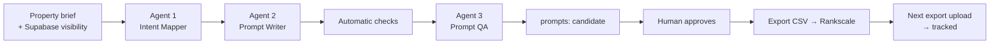

# Upstream workflow: prompt-generation agents

Three agents turn what we know about the hotel and its current visibility into new prompts for Rankscale to track. The output is a CSV to import into Rankscale → Search Terms. When Rankscale's next export is uploaded, those prompts are marked `tracked` automatically, which closes the loop.

Code: `agents/prompt_generation/pipeline.py` · prompts: `prompts.py` · contracts: `schema.py` · hotel facts: `briefs/<property>.json`

> **Check with Tanya and Truc:** the original plan names "3 green agents" without defining them here. This build assumes the three are **Intent Mapper → Prompt Writer → Prompt QA**. If the diagram means different agents, the pipeline is three functions in one file, so each can be swapped without touching the rest.

## The agents

| Agent | Input | What it decides | Output (validated) |
|---|---|---|---|
| **1. Intent Mapper** | Hotel brief (facts with source URLs); current intents with visibility, prompt count and top competitors (from Supabase); requested total and focus | Which intents need prompts and how many. It prioritises low-visibility intents the hotel can credibly serve, reuses existing intent names so data stays comparable, and proposes new intents only when the brief backs them | `IntentMap`: name, is_new, personas, occasions, priority, reason, prompts_to_generate |
| **2. Prompt Writer** | One intent from Agent 1, the brief, that intent's existing prompts, the count | Real traveller questions (10–35 words, Australian English), mostly unbranded, with occasion, comparison and local-context variants and at most one branded prompt | `DraftPrompts`: prompt_text, prompt_type, persona, rationale |
| **3. Prompt QA** | All drafts plus the automatic checks for each | Keep, rewrite or reject; scores realism, intent fit and measurability from 0 to 1 | `PromptReviews` |

## Automatic checks (code, not the model)

Run before Agent 3, and again on any rewrite. A failed check always rejects the prompt, whatever the model says.

| Check | Rule |
|---|---|
| Length | 8–40 words |
| Brand leak | A non-branded prompt must not contain any hotel alias, "InterContinental" or "IHG" |
| Near-duplicate | Token overlap (Jaccard) ≥ 0.72 with any tracked prompt, or with an earlier prompt in the same batch |

`quality_score` is the mean of the three QA scores. Rejected prompts are still saved with status `rejected` (unless they exactly match an existing prompt), so the team can see what was filtered out and why.

## Prompt lifecycle (`prompts.status`)

| Status | Meaning |
|---|---|
| `candidate` | Generated and passed QA; waiting for a human |
| `approved` | A human approved it on the Prompt generation tab |
| `rejected` | Failed QA or was rejected by a human |
| `exported` | Included in a Rankscale import CSV |
| `tracked` | Appeared in a Rankscale export, so it's being measured |

## Rankscale import file

The export has columns `search_term,topic,tags`. The topic is the intent name, which becomes `topic_name` in Rankscale's export. Tags hold `agent` plus the prompt type.

**Before the first real import, check these column names against Rankscale's Search Terms import screen.** Rankscale's import format isn't publicly documented. If it differs, change the header in `export_rankscale_csv()`.

## Running it

| How | Command |
|---|---|
| CLI, preview only | `python -m agents.prompt_generation.pipeline --total 30 --dry-run` |
| CLI, save candidates | `python -m agents.prompt_generation.pipeline --total 30 --focus "occasion-led celebrations"` |
| CLI, export approved | `python -m agents.prompt_generation.pipeline --export rankscale_import.csv` |
| UI | Prompt generation tab → **Run agents** → tick prompts → **Approve selected** → **Export approved for Rankscale** |

## Adding another hotel

1. Add the property with its aliases (see the README).
2. Create `agents/prompt_generation/briefs/<property_name_slug>.json` with verified facts and source URLs, following the Coogee brief.
3. Run the pipeline. With no visibility data yet, Agent 1 plans from the brief alone.
